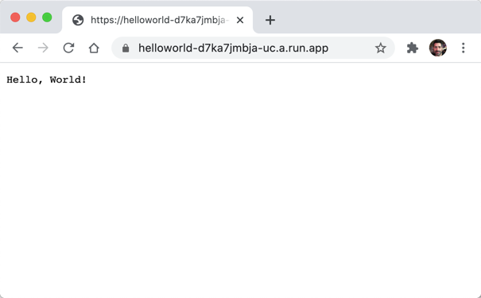

# Introduction

Quick start guide to the [Functions Framework for Dart].

## Background

The [Functions Framework for Dart] is an open source **FaaS** (Function as a
Service) framework that lets you write and deploy lightweight, event-driven
functions.

This means that not only do you not need to worry about managing physical
infrastructure, you don't even need to worry about writing the HTTP server and
request handling logic in your own code.

Instead, you use the framework to declare functions that will be wired up to
specific events your app is concerned with; you only write code for what should
happen once a function is triggered.

Functions created with this framework:

* Have a minimum amount of boilerplate, allowing you to focus on the business
  logic of your functions
* Support standard HTTP requests and requests triggered by [CloudEvents]
* Can be tested on your own machine
* Are packaged in an industry-standard, portable format (Docker images), which
  can be deployed to various hosted Cloud environments for running [containers]

The [Google Cloud] team defines the [specification] for Functions Framework
conformance (the contract between a framework and your code) for a number of
programming languages. You can find more details [here].

## Hello, World!

Here is a simple example of how to write a function that responds to HTTP
request events with a "Hello, World!" greeting:

```dart
import 'package:functions_framework/functions_framework.dart';
import 'package:shelf/shelf.dart';

@CloudFunction()
Response function(Request request) => Response.ok('Hello, World!');
```

If you deploy this simple example to [Cloud Run], you can easily choose to make
access public and test it over the Internet. The following image demonstrates
using an auto-generated public assigned by Cloud Run; the function is triggered
by an HTTP GET request event simply by accessing the URL with a browser.

<br>



<br>

When you are interactively testing your function, you can use tools like [curl]
or [postman], which are helpful for making and automating more complex web
request tests.

A best practice is to incorporate automated tests as part of your continuous
integration (CI) process during development. The example demonstrates the 
use of Dart tests, which we'll cover as part of this quick start.

## What's next

Using the example presented above, we will walk through a few quick start 
scenarios that demonstrate running the function

* locally during development: [Quick Start: Dart](quick-starts/01-quick-start-dart.md)
* locally using Docker to simulate a hosted environment: [Quick Start: Docker](quick-starts/02-quick-start-docker.md)
* hosted on [Cloud Run], a serverless platform on Google Cloud: [Quick Start: Cloud Run](quick-starts/03-quick-start-cloud-run.md)


---
[[toc]](README.md) [[next]](quick-starts/01-quick-start-dart.md)

<!-- reference links -->

[Cloud Run]: https://cloud.google.com/run

[containers]: https://www.docker.com/resources/what-container

[CloudEvents]: https://cloudevents.io/

[curl]: https://curl.se/docs/manual.html

[Functions Framework for Dart]: https://github.com/GoogleCloudPlatform/functions-framework-dart

[here]: https://github.com/GoogleCloudPlatform/functions-framework

[postman]: https://www.postman.com/product/api-client/

[specification]: https://github.com/GoogleCloudPlatform/functions-framework