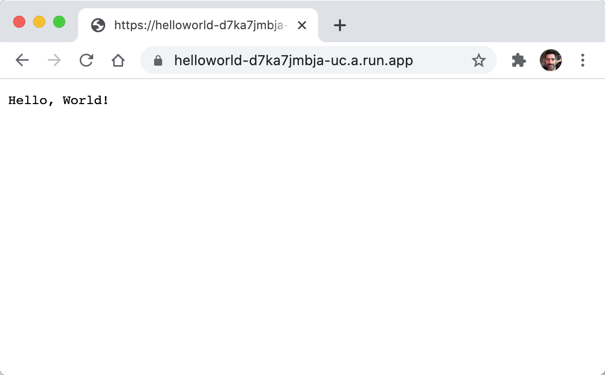

# Quick Start: Cloud Run

This quick start discusses how to build and deploy a function using
[Cloud Run], a serverless platform on [Google Cloud].

The instructions in this quick start can be run from a terminal on your own
machine or from [Cloud Shell], an online development and operations environment,
using the [Cloud Shell Editor].

Using the [Cloud Shell Editor] is beyond the scope of this quick start, but
this [codelab] can help you get started.

## Prerequisites

### Set up your Google Cloud project

Go to the [project selector] page. Select an existing or create a new
project. **Note your project ID for later.**

Creating a new project is highly recommended because you can destroy all
resources when you're finished just be deleting the project.

Make sure that billing is enabled for your project ([see how]).

### Set up the Cloud SDK (gcloud)

Install and configure [gcloud].

If you need help installing or configuring `gcloud` on your machine, see
[Quickstart: Getting started with Cloud SDK][quickstart].

> Note: `gcloud` is preinstalled in [Cloud Shell].

## Get a copy of the `hello` example

Clone this repo or download a [zip] archive and extract the contents. Change
directory to `examples/hello`.

## Build the container image using Cloud Build

[Cloud Build] is a fully serverless continuous integration / continuous delivery
(CI/CD) platform for [Google Cloud]. Instead of building the image on your own
machine, you can use `gcloud` to upload the project to Cloud Build. Cloud Build
knows how to build Docker images and save them to an image repository in the
container registry associated with your project.

Use the project ID that you selected (see the Prerequisites section for setting
up your project):

```shell
export PROJECT_ID=$(gcloud config get-value project)
export IMAGE_NAME=helloworld
gcloud builds submit --tag gcr.io/$PROJECT_ID/$IMAGE_NAME
...
```

Upon success, you will see a SUCCESS message containing the image name.

## Deploy the function to Cloud Run

```shell
gcloud run deploy --image gcr.io/$PROJECT_ID/$IMAGE_NAME --platform managed
```

1. You will be prompted for the service name: press Enter to accept the default
   name, helloworld.
1. You will be prompted for region: select the region of your choice, for
   example `us-central1`.
1. You will be prompted to allow unauthenticated invocations: respond `y`. Then
   wait a few moments until the deployment is complete. On success, the command
   line displays the service URL.

Visit your deployed function by opening the service URL in a web browser.

<br>



**Congratulations!** You have successfully deployed your function to Cloud Run!

## Clean up

Cloud Run does not charge when the service is not in use. However, you might
incur charges while the image is still stored in the Container Registry.

You can either just [delete the image] or delete the entire project (which will
free up all resources and stop any other charges from incurring) from
the [Manage resources] page.

---
[[toc]](../README.md) [[back]](02-quick-start-docker.md)

[Cloud Build]: https://cloud.google.com/cloud-build

[Cloud Run]: https://cloud.google.com/run

[Cloud Shell]: https://cloud.google.com/shell

[Cloud Shell Editor]: https://shell.cloud.google.com/?show=ide&environment_deployment=ide

[codelab]: https://codelabs.developers.google.com/codelabs/cloud-shell

[delete the image]: https://cloud.google.com/container-registry/docs/managing#deleting_images

[gcloud]: https://cloud.google.com/sdk/docs/install

[Google Cloud]: https://cloud.google.com/gcp

[incur charges]: https://cloud.google.com/container-registry/pricing

[Manage resources]: https://console.cloud.google.com/iam-admin/projects

[project selector]: https://console.cloud.google.com/projectselector2/home/dashboard

[quickstart]: https://cloud.google.com/sdk/docs/quickstart

[see how]: https://cloud.google.com/billing/docs/how-to/modify-project

[zip]: https://github.com/GoogleCloudPlatform/functions-framework-dart/archive/main.zip

