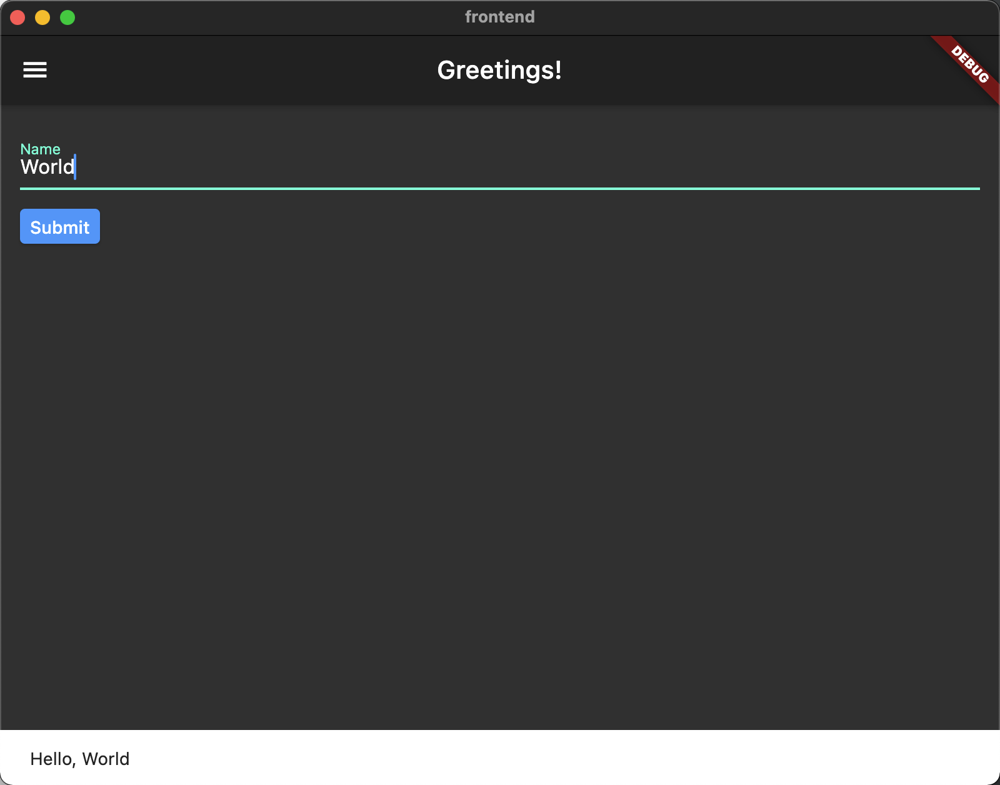

# Full stack demo with Flutter and Cloud Run

This is a demo of a full stack application built with [Dart] and [Flutter].

The **frontend** is a desktop Flutter app that sends a name that you enter to
the backend and then displays the response (a greeting in various languages) in
a snackbar (an ephemeral popup widget for displaying messages at the bottom of
the page).

The **backend** is a Dart function app that was generated using the
[Functions Framework for Dart]. It serves an HTTP endpoint that accepts a
JSON-encoded request body and returns a JSON-encoded response body. For the
demo, the function is hosted on `localhost` and on [Cloud Run], a fully
managed serverless platform on [Google Cloud].

## Requirements

- Dart: >=2.12.0 <3.0.0

## Build and deploy the backend

Change directory to `backend`.

```shell
cd backend
```

### Local machine

You can run the function on your local machine by entering:

```shell
dart run build_runner build --delete-conflicting-outputs
dart run bin/server.dart --port=8080 --target=function
```

If you have `make` installed on your system, you can just enter:

```shell
make run
```

Output:

```text
Listening on :8080
```

For more details see [backend/README].

### Cloud Run

If you have created a Google Cloud project and updated your local `gcloud`
configuration with the project ID, you can deploy the backend in a single step.

For example, assuming your project ID is `dart-demo` and you want
to deploy the function as a service called `greeting`, enter:

```shell
gcloud beta run deploy greeting --allow-unauthenticated --source=.
```

Output:

```text
Building using Dockerfile and deploying container to Cloud Run service [greeting] in project [dart-demo] region [us-central1]
✓ Building and deploying new service... Done.
  ✓ Uploading sources...
  ✓ Building Container... Logs are available at [https://console.cloud.google.com/cloud-build/builds/df7f07d1-d88b-4443-a2b1-bdfd3cdab15b?project=700116488077].
  ✓ Creating Revision... Revision deployment finished. Waiting for health check to begin.
  ✓ Routing traffic...
  ✓ Setting IAM Policy...
Done.
Service [greeting] revision [greeting-00001-yen] has been deployed and is 
serving 
100 percent of traffic.
Service URL: https://greeting-gpua4upw6q-uc.a.run.app
```

The function app endpoint is the Service URL printed on the last line.

See [Quickstart: Cloud Run] for details on setting up and using a Google
Cloud project.

### Verify the backend works

If you have `curl` installed on your system, you can enter the following:

```shell
URL=http://localhost:8080  # or your Cloud Run service URL
curl -X POST -H "content-type: application/json" -d '{ "name": "World" }' -w "\n" $URL
````

Output (example):

```text
{"salutation":"Hello","name":"World"}
```

## Build and run the frontend

Change directory to `frontend`.

```shell
cd frontend
```

The following assumes running on the macOS desktop. See Flutter docs for
building for Windows or Linux desktops.

If you have not enabled desktop support for your Flutter installation,
do so now with one of the following commands, as appropriate for your system:

```shell
flutter config --enable-windows-desktop
flutter config --enable-macos-desktop
flutter config --enable-linux-desktop
```

Output:

```text
Setting "enable-{DESKTOP}-desktop" value to "true".

You may need to restart any open editors for them to read new settings.
```

### Connect frontend to backend running on local machine

Replace {DESKTOP} with `windows`, `macos`, or `linux`.

```shell
flutter run -d {DESKTOP}
```

### Connect frontend to backend running on Cloud Run

For this demo, the `prod` configuration points to `backend`
running on Cloud Run.

First update your `prod` configuration with your Cloud Run project's
ServiceURL in `frontend/assets/config/prod.json` (note that this file
is in `frontend/.gitignore`; if you want to commit your change you
will need to remove or comment out the entry).

Then when running `flutter run` define our environment as `prod` and
replace {DESKTOP} with `windows`, `macos`, or `linux`:

```shell
flutter run -d {DESKTOP} --dart-define=ENV=prod
```

### Try it out



<!-- reference links -->

[backend/README]:
./backend/README.md

[Cloud Run]:
https://cloud.google.com/run

[Dart]:
https://dart.dev

[Google Cloud]:
https://cloud.google.com/

[Flutter]:
https://flutter.dev/

[Functions Framework for Dart]:
https://github.com/GoogleCloudPlatform/functions-framework-dart/

[Quickstart: Cloud Run]:
https://github.com/GoogleCloudPlatform/functions-framework-dart/blob/main/docs/quickstarts/03-quickstart-cloudrun.md
